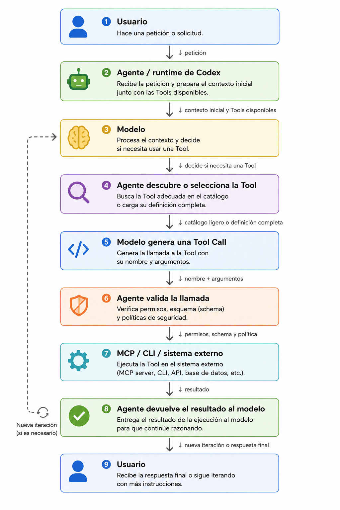

# Guía práctica de Tools en Codex para VS Code

Esta guía explica el flujo conceptual para descubrir, cargar y ejecutar herramientas cuando trabajamos con Codex dentro de VS Code. Su objetivo es separar tres elementos que a menudo se mezclan:

- El **modelo**, que interpreta el objetivo y propone llamadas.
- El **runtime de Codex**, que proporciona el contexto, aplica políticas y coordina la ejecución.
- La **Tool**, que realiza una operación concreta mediante un mecanismo autorizado.

> Esta guía describe un patrón conceptual. Las Tools disponibles y el flujo exacto dependen de la versión de Codex, la configuración de VS Code, las Skills, los plugins, los servidores MCP y las políticas del entorno.

## 1. Flujo canónico

Un modelo no ejecuta directamente una Tool solo porque el usuario la mencione. El runtime expone las capacidades disponibles, el modelo propone una invocación y el runtime decide si puede ejecutarse según los permisos y las políticas aplicables.



El ciclo puede resumirse así:

1. **Usuario**: formula una petición.
2. **Modelo**: interpreta el objetivo y decide si necesita una herramienta.
3. **Runtime de Codex**: proporciona el catálogo o contrato disponible y prepara el contexto.
4. **Modelo**: propone una Tool Call con nombre y argumentos.
5. **Runtime de Codex**: valida permisos, esquema, políticas y, cuando corresponde, solicita aprobación.
6. **Tool**: ejecuta la operación autorizada mediante MCP, CLI, API u otro mecanismo configurado.
7. **Runtime de Codex**: devuelve el resultado al modelo.
8. **Modelo**: razona con el resultado y responde o solicita otra herramienta.
9. **Usuario**: recibe la respuesta final.

La decisión del modelo no equivale a la ejecución. La separación importante es:

```text
Modelo propone → Runtime valida y coordina → Tool ejecuta → Runtime devuelve → Modelo razona
```

## 2. Tres capas que no deben confundirse

### 2.1 Catálogo

El catálogo es un inventario ligero que permite saber que existe una capacidad. Puede incluir el nombre, una descripción breve, la categoría, palabras clave y algunos metadatos.

```text
execute_query  → ejecutar una consulta contra PostgreSQL
describe_table → obtener la estructura de una tabla
```

Su objetivo es facilitar el descubrimiento sin cargar el contrato completo de todas las Tools.

### 2.2 Definición o contrato

El contrato contiene la información necesaria para utilizar una Tool correctamente: descripción, esquema de argumentos, restricciones, ejemplos y posibles errores.

```json
{
  "name": "execute_query",
  "description": "Execute a read-only SQL query",
  "parameters": {
    "type": "object",
    "properties": {
      "query": { "type": "string" }
    },
    "required": ["query"]
  }
}
```

El contrato no concede permisos por sí mismo. Las políticas y permisos efectivos pertenecen al runtime y al sistema que ejecuta la operación.

### 2.3 Invocación y resultado

La invocación es la llamada concreta que el modelo propone:

```text
Tool Call: execute_query
Arguments: { "query": "SELECT count(*) FROM users" }
```

El runtime debe validar el nombre, los argumentos, el esquema y las políticas antes de ejecutar. El resultado se devuelve al modelo como contexto dinámico; a partir de ahí puede responder, corregir la llamada o solicitar otra Tool.

## 3. Aplicación en VS Code con Codex

VS Code proporciona la interfaz de trabajo y Codex actúa como agente dentro del runtime configurado. En una instalación pueden convivir varios mecanismos:

| Mecanismo | Uso habitual |
| --- | --- |
| Tools integradas | Capacidades proporcionadas directamente por el entorno de Codex. |
| MCP | Conexión con servidores que exponen herramientas estructuradas. |
| CLI y terminal | Ejecución de comandos, scripts y validadores locales. |
| API o servicios externos | Operaciones remotas a través de integraciones autorizadas. |
| Skills | Procedimientos e instrucciones reutilizables; no son Tools por sí mismas. |
| `AGENTS.md` | Reglas de trabajo y contexto persistente; no es un catálogo ejecutable. |

La [documentación oficial de la extensión IDE de Codex](https://developers.openai.com/codex/ide) es el punto de referencia para la instalación y el uso en el editor. La disponibilidad concreta de Tools, MCP, Skills, búsqueda y aprobación depende de la versión instalada y de la configuración del entorno.

En la API de OpenAI, las categorías de herramientas incluyen Tools integradas, MCP Tools y llamadas de funciones definidas por el desarrollador. Esa clasificación es útil como modelo conceptual, pero no debe interpretarse como una garantía de que todas esas capacidades estén disponibles en cada instalación de Codex. Consulta siempre las capacidades expuestas por el runtime que estás utilizando.

No se debe asumir que Codex reproduce exactamente los mecanismos internos de otros productos, como Filesystem Retrieval de Cursor o Tool Search de Claude. Las herramientas, los catálogos y los mecanismos de carga deben comprobarse en cada entorno.

## 4. Implementar un catálogo portable

Cuando el runtime no ofrece una búsqueda nativa de Tools, se puede versionar un catálogo ligero dentro del workspace:

```text
tools/
└── postgres/
    ├── index.md
    ├── execute-query.md
    └── describe-table.md
```

`index.md` contiene únicamente el inventario resumido:

```markdown
# PostgreSQL Tools

- `execute_query`: ejecutar consultas SQL de solo lectura.
- `describe_table`: consultar columnas y tipos de una tabla.
```

`execute-query.md` contiene el contrato completo:

```markdown
# execute_query

## Propósito

Ejecuta una consulta SQL de solo lectura contra la base de datos configurada.

## Argumentos

- `query` (string, obligatorio): consulta SQL.
- No permite `INSERT`, `UPDATE`, `DELETE`, `DROP` ni sentencias múltiples.

## Resultado

Devuelve filas y metadatos de columnas.
```

El flujo portable sería:

1. El usuario pregunta cuántos usuarios hay registrados.
2. El modelo identifica que necesita consultar una base de datos.
3. El runtime o el agente busca `execute_query` en el índice.
4. Se lee el contrato completo de `execute_query`.
5. El modelo propone la llamada y sus argumentos.
6. El runtime valida la consulta y sus permisos.
7. La Tool autorizada ejecuta la operación.
8. El resultado vuelve al modelo para redactar la respuesta.

En Codex, esta búsqueda puede apoyarse en Tools de filesystem disponibles, `rg`, una Skill o un índice propio. Que los archivos existan en el workspace no garantiza por sí solo que el modelo los haya leído.

## 5. Seguridad del contexto recuperado

Un archivo recuperado es información para razonar, no una autorización automática. Puede estar desactualizado, contener errores o incluir instrucciones maliciosas.

Aplicar siempre estas reglas:

- Separar documentación, datos y políticas de ejecución.
- No permitir que una definición recuperada eleve permisos o cambie las reglas del runtime.
- Validar el nombre de la Tool y sus argumentos contra el contrato real.
- Aplicar allowlists para operaciones destructivas o con acceso a datos sensibles.
- Solicitar aprobación humana antes de escribir, borrar, publicar o modificar sistemas externos.
- Tratar el contenido del workspace como potencialmente no confiable si procede de terceros.
- No desactivar la validación TLS.
- No registrar secretos en prompts, resultados, trazas ni archivos versionados.
- Registrar la Tool lógica, identidad, operación, resultado resumido, latencia y motivo de rechazo sin almacenar credenciales.

El retrieval amplía el contexto dinámico, pero también amplía la superficie de prompt injection. Recuperar más información no sustituye la validación ni los controles de permisos.

## 6. Medición y comparación

No es correcto trasladar directamente a Codex porcentajes publicados para otros productos. Las cifras dependen del modelo, el runtime, el catálogo, la caché, la tarea y la metodología.

Para comparar estrategias en este proyecto, registrar al menos:

| Métrica | Qué indica |
| --- | --- |
| Tokens de contexto inicial | Coste de cargar prompt, catálogo y reglas. |
| Tokens totales | Coste completo de descubrimiento y ejecución. |
| Latencia | Tiempo añadido por la búsqueda y la carga del contrato. |
| Tools recuperadas | Precisión y tamaño de la selección. |
| Tool Calls inválidas | Calidad del contrato y de la validación. |
| Tasa de éxito | Porcentaje de tareas completadas correctamente. |
| Aprobaciones y rechazos | Riesgo operativo y fricción para el usuario. |
| Coste | Impacto económico del workflow. |

La comparación mínima debería ejecutar el mismo conjunto de tareas con tres configuraciones:

1. Todas las definiciones cargadas upfront.
2. Catálogo ligero más retrieval desde filesystem.
3. Tool Search nativo, únicamente si el runtime utilizado lo ofrece y está verificado.

El resultado debe incluir calidad, coste y latencia. Ahorrar tokens no compensa recuperar una Tool incorrecta o ejecutar una operación insegura.

## 7. Tabla de decisión

| Necesidad | Mecanismo recomendado en VS Code + Codex |
| --- | --- |
| Tool crítica y usada en casi todas las tareas | Definición upfront. |
| Muchas Tools especializadas | Catálogo ligero y retrieval. |
| Búsqueda gestionada por el runtime | Tool Search, solo si está disponible y verificado. |
| Operaciones sobre el repositorio | CLI, terminal y Skills. |
| Operaciones estructuradas sobre Power BI o Fabric | MCP conectado al servicio autorizado. |
| Procedimiento reutilizable | Skill. |
| Inicio explícito de un workflow | Command o petición explícita al agente. |
| Documentación o métricas de negocio | Archivos versionados y recuperación bajo demanda. |

La decisión debe considerar permisos, auditabilidad, latencia, coste y facilidad de mantenimiento.

## 8. Regla práctica para este repositorio

Para trabajar con Codex en VS Code:

1. Mantener las reglas generales en `AGENTS.md`.
2. Mantener procedimientos reutilizables en `skills/`.
3. Usar MCP para capacidades estructuradas de Power BI y Fabric.
4. Usar CLI para Git, validadores, tests y scripts locales.
5. Usar archivos de documentación para conocimiento de negocio que no deba cargarse siempre.
6. Pedir a Codex que compruebe las Tools disponibles antes de asumir que existe una capacidad.
7. Revisar y validar cada Tool Call antes de permitir efectos externos.

## 9. Glosario breve

- **Tool**: capacidad ejecutable que realiza una operación concreta.
- **Tool Call**: invocación propuesta con un nombre y unos argumentos.
- **Runtime**: capa que coordina el modelo, el contexto, las políticas y la ejecución.
- **MCP**: protocolo y mecanismo para conectar servidores que exponen herramientas.
- **Catálogo**: inventario ligero de capacidades disponibles.
- **Contrato**: definición detallada de una Tool y de sus argumentos.
- **Skill**: procedimiento o conjunto de instrucciones reutilizables; no es una Tool automáticamente.
- **Retrieval**: recuperación selectiva de información para incorporarla al contexto.

## Referencias

- [Extensión IDE de Codex](https://developers.openai.com/codex/ide)
- [Referencia oficial de Responses API: Tools](https://developers.openai.com/api/reference/cli/resources/responses/methods/create)

---

[← Anterior](08-estrategia-hibrida.md) · [Índice](../../README.md) · [Siguiente →](../04-integraciones/00-mcp-introduccion.md)
